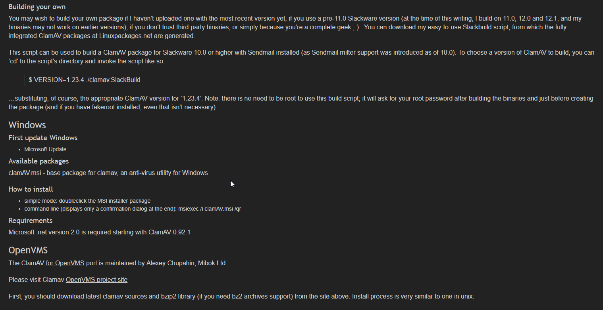
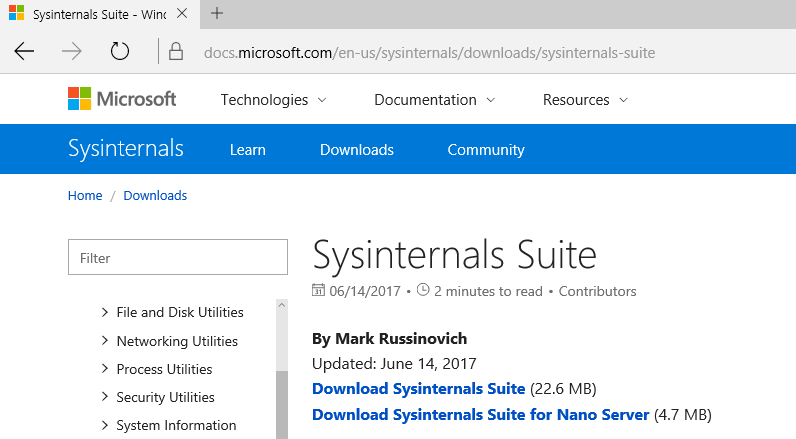
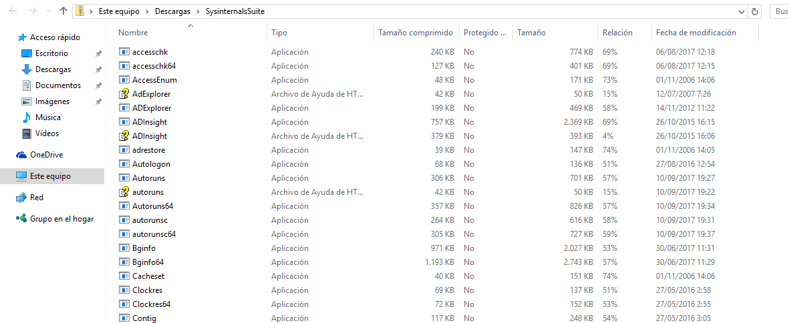
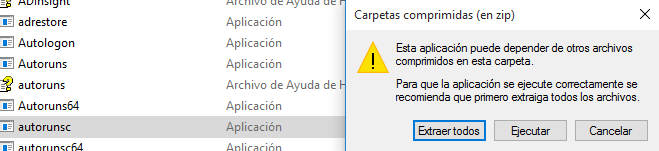

# Atenuandos efectos

---

* Instalamos el antivirus `clamav` en Ubuntu.

* En la página web del antivirus, tenemos una guía de como usarlo, instalarlo y actualizarlo.

* Vamos a Windows a descargar/instalar la herramienta `suite Sysinternals`.

* Ejecutamos los **autoruns** y **proccess explorers**.

* Esto abrirá nuestra `cmd` y ejecutará varios comandos, obteniendo informes y datos del sistema. :+1:

---
