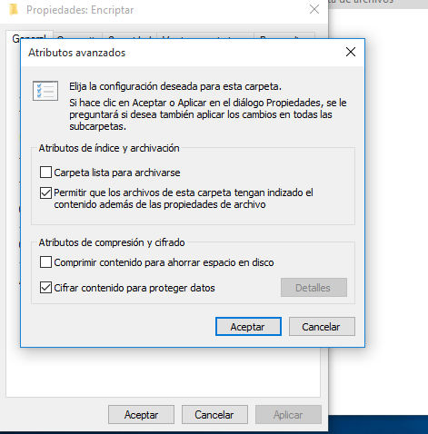
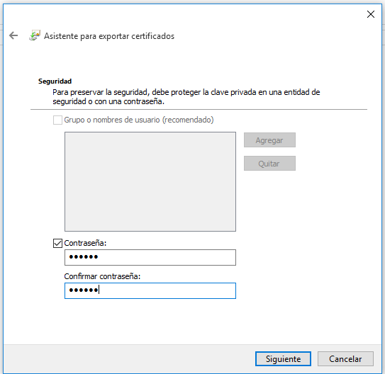
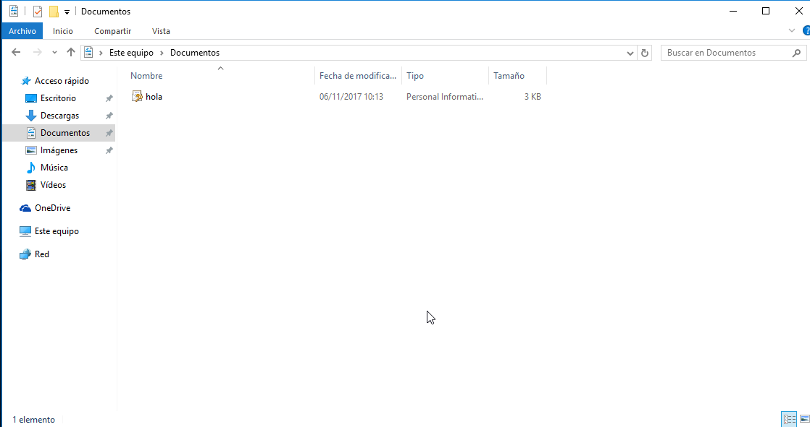

# Sistema de cifrado de archivos.

---

* Creamos una carpeta en la ubicación que nosotros queramos.
  * Luego hacemos **Click Derecho -> Propiedades -> Opciones Avanzadas**.
  * `Cifrar contenido para proteger datos.`

* Comprobamos que el nombre de la carpeta cambia y te da la opción de hacer una copia de seguridad y añadir una clave de cifrado.

* Procedemos a hacer la copia y crear clave.

* Hacemos siguiente siguiente hasta llegar a la contraseña.

* Elegimos una contraseña.

* Y ahora vamos a `Documentos` y ya tenemos el archivo encriptado.

---
